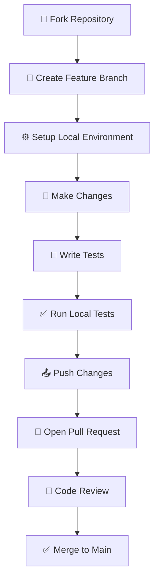
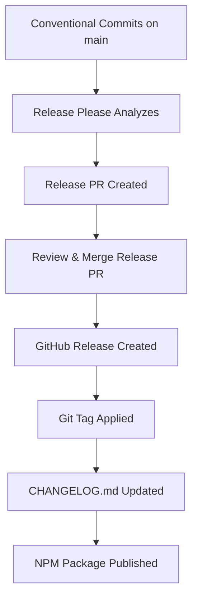

# 🤝 Contributing Guide

Thank you for your interest in contributing to **AI ↔ Obsidian Service**! This guide explains how to work with the repository and submit changes effectively.

## 🚀 Quick Start

**TL;DR for experienced developers:**
- **Python 3.13** and **npm** (Node.js 20) required
- Fork repo → create feature branch from `main`
- Set up virtual environment and install requirements
- Install git hooks: `npm ci && npx husky install`
- Write tests and run locally: `export AIOBS_TEST_MODE=1 && pytest -v`
- Open PR with [Conventional Commit](https://www.conventionalcommits.org/) title

---

## 📋 Table of Contents

- [🛠️ Development Workflow](#development-workflow)
- [📋 Prerequisites](#prerequisites)
- [⚙️ Environment Setup](#environment-setup)
- [🪝 Git Hooks & Automation](#git-hooks--automation)
- [📝 Commit & PR Guidelines](#commit--pr-guidelines)
- [🧪 Testing & Quality](#testing--quality)
- [🚀 Local Development](#local-development)
- [🤖 CI/CD Pipeline](#cicd-pipeline)
- [📦 Release Process](#release-process)
- [🐛 Issue Reporting](#issue-reporting)
- [🆘 Getting Help](#getting-help)

---

## 🛠️ Development Workflow

### 📋 Complete Contribution Flow



### 1️⃣ **Fork & Clone**
```bash
# Fork on GitHub, then clone your fork
git clone https://github.com/YOUR-USERNAME/ai-obsidian-service.git
cd ai-obsidian-service
git remote add upstream https://github.com/ORIGINAL-OWNER/ai-obsidian-service.git
```

### 2️⃣ **Create Feature Branch**
```bash
# Sync with upstream first
git fetch upstream
git checkout main
git merge upstream/main

# Create feature branch with descriptive name
git checkout -b feat/search-performance-optimization
# or: fix/pdf-parsing-timeout, docs/api-examples, etc.
```

### 3️⃣ **Make Changes**
- Write clean, well-documented code
- Follow existing code style and patterns
- Add comprehensive tests for new functionality
- Update documentation (README, API docs, etc.)

### 4️⃣ **Test & Validate**
```bash
# Run full test suite
export AIOBS_TEST_MODE=1  # Windows: $env:AIOBS_TEST_MODE=1
pytest -v --cov=indexer

# Test specific functionality
pytest tests/test_your_feature.py -v

# Export OpenAPI if API changed
python scripts/export_openapi.py
```

### 5️⃣ **Submit PR**
```bash
# Push to your fork
git push origin feat/search-performance-optimization

# Open PR on GitHub with:
# - Descriptive title following Conventional Commits
# - Completed PR template
# - Reference to related issues
```

---

## 📋 Prerequisites

### ✅ **Required Software**

| Tool | Version | Installation | Purpose |
|------|---------|-------------|----------|
| **Python** | 3.13 | [python.org](https://python.org) | Runtime environment |
| **Node.js** | 20+ | [nodejs.org](https://nodejs.org) | Git hooks and tooling |
| **npm** | Latest | Included with Node.js | Package management |
| **Git** | 2.25+ | [git-scm.com](https://git-scm.com) | Version control |

### 🔧 **System Dependencies**

**PDF processing support** (required for tests and indexing):

```bash
# Debian/Ubuntu
sudo apt-get update && sudo apt-get install -y --no-install-recommends poppler-utils

# macOS
brew install poppler

# Fedora/RHEL/CentOS
sudo dnf install poppler-utils

# Windows (using Chocolatey)
choco install poppler

# Windows (using Scoop)
scoop install poppler

# Arch Linux
sudo pacman -S poppler
```

### ✅ **Verify Prerequisites**
```bash
# Check versions
python --version    # Should be 3.13.x
node --version      # Should be 20.x or higher
npm --version       # Should be latest
git --version       # Should be 2.25+

# Check system dependencies
pdfinfo -v         # Should show poppler version
```

---

## ⚙️ Environment Setup

### 🐍 **Method 1: Virtual Environment (Recommended)**

**Best for CI parity and isolated development:**

```bash
# Create virtual environment
python -m venv .venv

# Activate (choose your platform)
source .venv/bin/activate              # Linux/macOS
.venv\Scripts\activate                 # Windows Command Prompt
.venv\Scripts\Activate.ps1             # Windows PowerShell

# Upgrade pip and install dependencies
python -m pip install --upgrade pip setuptools wheel
python -m pip install -r requirements.txt
python -m pip install pytest pytest-cov

# Install development tooling
npm ci
npx husky install
```

### 🐍 **Method 2: Conda (Alternative)**

**If you prefer Conda environments:**

```bash
# Create environment from file
conda env create -n ai-obsidian -f environment.yml
conda activate ai-obsidian

# Install git hooks
npm ci
npx husky install
```

### 🏭 **Method 3: Docker (Containerized)**

**For consistent cross-platform development:**

```bash
# Build development container
docker build -t ai-obsidian-dev -f Dockerfile.dev .

# Run with volume mounts
docker run -it --rm \
  -v $(pwd):/workspace \
  -p 8000:8000 \
  ai-obsidian-dev bash
```

### ✅ **Verify Installation**

```bash
# Check Python environment
python --version                       # Should show 3.13.x
pip list | grep -E "(pytest|fastapi)" # Should show installed packages

# Test basic functionality
export AIOBS_TEST_MODE=1               # Enable test mode
pytest --version                       # Should work without errors
pytest tests/test_basic.py -v          # Run a simple test

# Verify git hooks
npx husky --version                    # Should show husky version
```

### 🔧 **Troubleshooting Setup**

**Common issues and solutions:**

| Issue | Solution |
|-------|----------|
| `python: command not found` | Install Python 3.13 or check PATH |
| `npm: command not found` | Install Node.js 20+ |
| `pytest: command not found` | Run `pip install pytest` in activated environment |
| `poppler not found` | Install poppler-utils for your OS |
| `husky hooks not working` | Run `npx husky install` again |

---

## 🪝 Git Hooks & Automation

### 🔄 **Automatic Hooks**

After running `npx husky install`, these hooks activate:

| Hook | Trigger | Purpose | Can Skip |
|------|---------|---------|----------|
| **commit-msg** | Every commit | Validates Conventional Commit format | No |
| **pre-push** | Before `git push` | Runs full test suite | Yes* |

*Skip with: `HUSKY_SKIP_TESTS=1 git push`

### 🛠️ **Manual Hook Commands**

```bash
# Lint commit messages between refs
npx commitlint --from HEAD~5 --to HEAD

# Test single commit message
echo "feat(api): add health endpoint" | npx commitlint

# Manually run pre-push checks
npm run pre-push

# Skip tests on push (docs-only changes)
HUSKY_SKIP_TESTS=1 git push origin feature-branch
```

### 🔧 **Hook Troubleshooting**

```bash
# If hooks don't run, reinstall them
npx husky install

# Check hook permissions (Unix-like systems)
ls -la .husky/

# Manually test commit-msg hook
.husky/commit-msg "feat(api): test message"

# Debug hook execution
HUSKY_DEBUG=1 git commit -m "feat: test commit"
```

---

## 📝 Commit & PR Guidelines

### 📐 **Conventional Commits Format**

```
<type>(<scope>): <description>

[optional body]

[optional footer(s)]
```

### 🏷️ **Commit Types**

| Type | Purpose | Example | Version Impact |
|------|---------|---------|----------------|
| `feat` | New feature | `feat(api): add search endpoint` | Minor (0.1.0) |
| `fix` | Bug fix | `fix(parser): handle empty PDFs` | Patch (0.0.1) |
| `docs` | Documentation | `docs(readme): update examples` | None |
| `style` | Code formatting | `style: fix linting issues` | None |
| `refactor` | Code refactoring | `refactor(index): optimize search` | None |
| `perf` | Performance improvement | `perf(faiss): reduce memory usage` | Patch |
| `test` | Add/update tests | `test(api): add integration tests` | None |
| `build` | Build system | `build: update dependencies` | None |
| `ci` | CI configuration | `ci: add release workflow` | None |
| `chore` | Maintenance | `chore: update .gitignore` | None |
| `revert` | Revert changes | `revert: feat(api): remove endpoint` | None |

### 🎯 **Scopes (Choose Most Relevant)**

| Scope | Component | Examples |
|-------|-----------|----------|
| `api` | FastAPI endpoints | Routes, schemas, middleware |
| `index` | Document indexing | FAISS operations, chunking |
| `parser` | Document parsing | PDF/EPUB/Markdown processors |
| `rag` | RAG and LLM | Ollama integration, prompts |
| `cli` | Command line | CLI commands and options |
| `config` | Configuration | Settings, environment variables |
| `docs` | Documentation | README, API docs, guides |
| `ci` | CI/CD | GitHub Actions, testing |
| `deps` | Dependencies | Package updates, security |

### ✅ **Good Commit Examples**
```bash
feat(api): add document search with semantic filtering
fix(parser): resolve PDF metadata extraction timeout
docs(contributing): add detailed setup instructions
perf(index): optimize vector similarity computation
test(rag): add unit tests for prompt generation
build(deps): bump fastapi to 0.104.1 for security fix
```

### ❌ **Bad Commit Examples**
```bash
fix stuff                    # Too vague, no scope
Add new feature             # No type, unclear
WIP                         # Work in progress, not descriptive
Updated files               # No context about what changed
feat: fixes                 # Wrong type for fixes
```

### 🔄 **Pull Request Requirements**

#### 📋 **PR Checklist**
- [ ] **Title follows Conventional Commits** (becomes merge commit message)
- [ ] **All CI checks pass** (tests, linting, formatting)
- [ ] **Tests added** for new functionality
- [ ] **Documentation updated** (README, API docs, etc.)
- [ ] **PR template completed** with all sections
- [ ] **No merge conflicts** with target branch
- [ ] **OpenAPI schema exported** (if API changed)

#### 📝 **PR Title Examples**
```
feat(api): add health check endpoint with detailed status
fix(parser): resolve timeout issues with large PDF files
docs(readme): improve installation instructions for Windows
refactor(index): optimize chunk splitting algorithm
```

#### 📄 **PR Template Usage**

Our PR template includes:

```markdown
## 📋 Description
Brief description of changes and motivation.
- What problem does this solve?
- How does this change the behavior?

## 🔄 Type of Change
- [ ] 🐛 Bug fix (non-breaking change fixing an issue)
- [ ] ✨ New feature (non-breaking change adding functionality)
- [ ] 💥 Breaking change (fix or feature causing existing functionality to change)
- [ ] 📝 Documentation update
- [ ] 🔧 Refactoring (no functional changes)
- [ ] ⚡ Performance improvement
- [ ] 🧪 Test improvements

## 🧪 Testing
- [ ] Tests pass locally: `pytest -v`
- [ ] New tests added for new functionality
- [ ] Manual testing completed
- [ ] OpenAPI schema exported (if API changed)

## 📝 Checklist
- [ ] Code follows project style guidelines
- [ ] Self-review completed
- [ ] Documentation updated
- [ ] No breaking changes (or clearly documented)
```

---

## 🧪 Testing & Quality

### 🔍 **Testing Strategy**

| Test Type | Purpose | Command | Coverage |
|-----------|---------|---------|----------|
| **Unit** | Individual functions | `pytest tests/unit/ -v` | Business logic |
| **Integration** | Component interaction | `pytest tests/integration/ -v` | API endpoints |
| **E2E** | Full workflow | `pytest tests/e2e/ -v` | User scenarios |

### 🛠️ **Local Testing Commands**

```bash
# Setup test environment
export AIOBS_TEST_MODE=1              # Enables test isolation
export LOG_LEVEL=DEBUG                # Verbose logging

# Run all tests with coverage
pytest -v --cov=indexer --cov-report=html --cov-report=term

# Run specific test categories
pytest tests/test_api.py -v           # API tests only
pytest tests/test_parser.py -v        # Parser tests only
pytest -k "search" -v                 # Tests matching "search"

# Run tests with different markers
pytest -m "slow" -v                   # Only slow tests
pytest -m "not slow" -v               # Skip slow tests

# Parallel testing (faster)
pytest -n auto                        # Auto-detect CPU cores
pytest -n 4                          # Use 4 processes
```

### 🐛 **Debugging Tests**

```bash
# Run single test with debugging
pytest tests/test_specific.py::test_function -v -s --pdb

# Debug failing test
pytest tests/test_failing.py -v -s --pdb-trace

# Run with print statements visible
pytest tests/test_debug.py -v -s

# Enable debug logging for specific module
export LOG_LEVEL=DEBUG
export PYTHONPATH=src
pytest tests/test_module.py -v -s
```

### 📊 **Coverage Requirements**

- **Minimum coverage**: 80% overall
- **New code**: 90% coverage required
- **Critical paths**: 95% coverage (API, indexing)

```bash
# Generate coverage report
pytest --cov=indexer --cov-report=html
open htmlcov/index.html               # View detailed report

# Check coverage thresholds
pytest --cov=indexer --cov-fail-under=80
```

### ✅ **Quality Gates**

All PRs must pass:
- [ ] All tests pass
- [ ] Coverage requirements met
- [ ] No linting errors
- [ ] Type checking passes
- [ ] Security scan clean

---

## 🚀 Local Development

### 🌐 **Running the Service**

```bash
# Method 1: Direct uvicorn (recommended for development)
uvicorn indexer.app:app --host 127.0.0.1 --port 8000 --reload --log-level debug

# Method 2: Using CLI wrapper
python -m indexer.cli serve --host 127.0.0.1 --port 8000 --debug

# Method 3: Using Make (if Makefile exists)
make serve

# Method 4: Docker development
docker-compose up --build
```

### 📊 **API Documentation Access**

Once running, access these URLs:

| Resource | URL | Purpose |
|----------|-----|---------|
| **Swagger UI** | http://127.0.0.1:8000/docs | Interactive API testing |
| **ReDoc** | http://127.0.0.1:8000/redoc | Clean API documentation |
| **OpenAPI JSON** | http://127.0.0.1:8000/openapi.json | Raw schema export |
| **Health Check** | http://127.0.0.1:8000/health | Service status |

### 📄 **API Schema Management**

When you modify API endpoints or models:

```bash
# Export updated OpenAPI schema
python scripts/export_openapi.py

# Verify schema is valid
python -c "import json; json.load(open('openapi.json'))"

# Generate client libraries (optional)
openapi-generator generate -i openapi.json -g python-client -o clients/python/

# Commit schema changes
git add openapi.json docs/api/
git commit -m "docs(api): update OpenAPI schema for new search endpoint"
```

### 🔧 **Development Tools**

```bash
# Code formatting
black src/ tests/                     # Format Python code
isort src/ tests/                     # Sort imports

# Linting
flake8 src/ tests/                    # Check code style
mypy src/                            # Type checking
bandit -r src/                       # Security analysis

# Pre-commit hooks (optional)
pre-commit install                    # Install git hooks
pre-commit run --all-files           # Run on all files
```

### 📝 **Database & Index Management**

```bash
# Build search index
export AIOBS_TEST_MODE=1
python -m indexer.cli build --config config.test.yaml

# Check index status
python -m indexer.cli status

# Reset index
python -m indexer.cli clean

# Export index statistics
python -m indexer.cli stats --format json > index_stats.json
```

---

## 🤖 CI/CD Pipeline

### 🔄 **Automated Checks**

#### **Pull Request Pipeline**
```yaml
name: PR Checks
on: [pull_request]

jobs:
  test:
    runs-on: ubuntu-latest
    steps:
      - uses: actions/checkout@v4
      - name: Setup Python 3.13
        uses: actions/setup-python@v4
        with:
          python-version: '3.13'
      - name: Install dependencies
        run: |
          pip install -r requirements.txt
          pip install pytest pytest-cov
      - name: Run tests
        env:
          AIOBS_TEST_MODE: 1
        run: pytest -v --cov=indexer
  
  lint:
    runs-on: ubuntu-latest
    steps:
      - uses: actions/checkout@v4
      - name: Lint commit messages
        uses: wagoid/commitlint-github-action@v5
  
  semantic-pr:
    runs-on: ubuntu-latest
    steps:
      - uses: amannn/action-semantic-pull-request@v5
        env:
          GITHUB_TOKEN: ${{ secrets.GITHUB_TOKEN }}
```

#### **Main Branch Pipeline**
- **Release Please**: Automated versioning and changelog
- **Security Scanning**: Dependency vulnerability checks
- **Documentation**: Auto-deploy API docs

### 🔄 **Reproducing CI Locally**

```bash
# Setup exactly like CI
python -m venv .venv-ci
source .venv-ci/bin/activate
pip install --upgrade pip
pip install -r requirements.txt
pip install pytest pytest-cov

# Run tests like CI
export AIOBS_TEST_MODE=1
pytest -v --cov=indexer --cov-report=term

# Check commit message format
npx commitlint --from HEAD~1 --to HEAD

# Validate PR title format (manual check)
echo "feat(api): add search endpoint" | npx commitlint
```

### 📊 **CI Artifacts**

Generated artifacts available in CI:
- **Test reports**: JUnit XML format
- **Coverage reports**: HTML and Cobertura XML
- **OpenAPI schema**: JSON export
- **Security scan**: SARIF format

---

## 📦 Release Process

### 🔄 **Automated Release Workflow**

We use **[Release Please](https://github.com/googleapis/release-please)** for fully automated releases:



### 📋 **Version Bumping Rules**

| Commit Type | Version Bump | Example |
|-------------|--------------|---------|
| `feat:` | **Minor** | 1.0.0 → 1.1.0 |
| `fix:` | **Patch** | 1.0.0 → 1.0.1 |
| `feat!:` or `BREAKING CHANGE:` | **Major** | 1.0.0 → 2.0.0 |
| `docs:`, `style:`, `test:` | **None** | No version change |

### 🚨 **Release Best Practices**

#### **DO:**
- ✅ Write clear, descriptive commit messages
- ✅ Use conventional commit format consistently
- ✅ Include breaking change notes in commit body
- ✅ Update documentation before release
- ✅ Test release candidates thoroughly

#### **DON'T:**
- ❌ Edit `CHANGELOG.md` manually (automation handles it)
- ❌ Bump version numbers manually (release-please manages versions)
- ❌ Create GitHub releases manually (automated process)
- ❌ Push directly to `main` (use PRs for all changes)

### 📝 **Breaking Change Format**

```bash
# Method 1: Use ! in type
feat(api)!: change search response format

# Method 2: Use BREAKING CHANGE footer
feat(api): improve search performance

BREAKING CHANGE: The search response now returns results in a different format.
The 'items' field has been renamed to 'documents' and includes additional metadata.
```

---

## 🐛 Issue Reporting

### 📋 **Issue Templates**

We provide templates for consistent reporting:

#### 🐛 **Bug Report**
```markdown
---
name: 🐛 Bug Report
about: Report a bug to help us improve
title: '[BUG] '
labels: bug
---

## 🐛 Bug Description
A clear and concise description of what the bug is.

## 🔄 Steps to Reproduce
1. Go to '...'
2. Click on '...'
3. Scroll down to '...'
4. See error

## ✅ Expected Behavior
A clear description of what you expected to happen.

## ❌ Actual Behavior
A clear description of what actually happened.

## 📸 Screenshots
If applicable, add screenshots to help explain your problem.

## 🌍 Environment
- **OS**: [e.g., Ubuntu 22.04, Windows 11, macOS 13]
- **Python Version**: [e.g., 3.13.0]
- **Package Version**: [e.g., 1.2.3]
- **Browser** (if applicable): [e.g., Chrome 118, Firefox 119]

## 📝 Additional Context
Add any other context about the problem here.

## 🔧 Possible Solution
If you have ideas on how to fix this, please share them.
```

#### ✨ **Feature Request**
```markdown
---
name: ✨ Feature Request
about: Suggest an idea for this project
title: '[FEATURE] '
labels: enhancement
---

## ✨ Feature Description
A clear and concise description of the feature you'd like to see.

## 🎯 Use Case
Describe the use case and why this feature would be valuable.
- Who would use this feature?
- In what scenarios?
- What problem does it solve?

## 💡 Proposed Solution
Describe how you envision this feature working.

## 🔄 Alternative Solutions
Describe any alternative solutions or workarounds you've considered.

## 📋 Implementation Ideas
If you have technical implementation ideas, share them here.

## 📊 Impact Assessment
- Would this be a breaking change?
- How would this affect existing users?
- What's the maintenance burden?
```

### 🔍 **Before Creating an Issue**

1. **Search existing issues**: Use GitHub's search to check for duplicates
2. **Check documentation**: Review README, API docs, and guides
3. **Try latest version**: Ensure you're using the most recent release
4. **Test with minimal setup**: Reproduce with simplest possible configuration

### 🏷️ **Issue Labels**

| Label | Purpose | Color |
|-------|---------|-------|
| `bug` | Something isn't working | Red |
| `enhancement` | New feature or request | Blue |
| `documentation` | Improvements to docs | Green |
| `good first issue` | Good for newcomers | Purple |
| `help wanted` | Extra attention needed | Yellow |
| `priority:high` | Urgent issues | Orange |
| `priority:low` | Nice to have | Gray |

### 🔒 **Security Issues**

For security vulnerabilities:
1. **DO NOT** create public issues
2. **Email**: security@yourproject.com
3. **Follow**: Responsible disclosure process in `SECURITY.md`
4. **Include**: Detailed reproduction steps and impact assessment

---

## 🆘 Getting Help

### 🔍 **Self-Help Resources**

Before asking for help, try these resources:

| Resource | Purpose | Link |
|----------|---------|------|
| **README** | Setup and basic usage | `README.md` |
| **API Docs** | Endpoint reference | `/docs` when running |
| **Issues** | Known problems and solutions | GitHub Issues |
| **Discussions** | Community Q&A | GitHub Discussions |
| **Changelog** | Recent changes | `CHANGELOG.md` |

### 💬 **Getting Help Process**

#### 1️⃣ **Search First**
```bash
# Search GitHub issues
# Use keywords like: "error message", "feature name", "setup"

# Check closed issues too - your problem might be solved
# Look at issue labels: bug, documentation, help-wanted
```

#### 2️⃣ **Gather Information**
Before asking, collect:
- **Exact error messages** (full stack traces)
- **Environment details** (OS, Python version, package version)
- **Configuration files** (remove sensitive data)
- **Steps to reproduce** (minimal example)
- **What you've tried** (show debugging efforts)

#### 3️⃣ **Choose Right Channel**

| Question Type | Best Place | Response Time |
|---------------|------------|---------------|
| **Bug reports** | GitHub Issues | 1-3 days |
| **Feature requests** | GitHub Issues | 1-7 days |
| **Usage questions** | GitHub Discussions | 1-2 days |
| **Security issues** | Email (private) | 24 hours |
| **Documentation fixes** | Pull Request | 1-2 days |

#### 4️⃣ **Write Good Questions**

**Good question format:**
```markdown
## 🎯 What I'm trying to do
I want to index a large PDF library and search it via API.

## 🔧 What I've tried
1. Followed README setup instructions
2. Created config.yaml with my PDF path
3. Ran `make build` but got timeout errors

## ❌ Error details
```
Error message here with full stack trace
```

## 🌍 Environment
- OS: Ubuntu 22.04
- Python: 3.13.0
- Package: 1.2.3
- PDF count: ~500 files, ~2GB total

## 🤔 Specific question
Is there a way to increase the PDF parsing timeout, or should I process files in smaller batches?
```

### 🤝 **Community Guidelines**

- **Be patient**: Maintainers are volunteers
- **Be respectful**: Follow our Code of Conduct
- **Be specific**: Vague questions get vague answers
- **Give back**: Help others when you can
- **Say thanks**: Acknowledge helpful responses

### 📞 **Emergency Contact**

For urgent issues affecting production or security:
- **Security vulnerabilities**: security@yourproject.com
- **Production outages**: Create GitHub issue with `priority:high` label
- **Maintainer contact**: Check `CODEOWNERS` file

---

## 🤝 Code of Conduct

By participating in this project, you agree to abide by our [Code of Conduct](CODE_OF_CONDUCT.md) based on the [Contributor Covenant](https://www.contributor-covenant.org/).

### 🌟 Our Standards

**We are committed to providing a welcoming and inspiring community for all.**

#### ✅ **Expected Behavior**
- **Be respectful** and inclusive in all interactions
- **Welcome newcomers** and help them learn
- **Focus on constructive feedback** that helps improve the project
- **Respect different viewpoints** and experiences
- **Show empathy** towards other community members
- **Accept responsibility** and apologize for mistakes

#### ❌ **Unacceptable Behavior**
- Harassment, discrimination, or offensive comments
- Personal attacks or trolling
- Publishing others' private information
- Using sexualized language or imagery
- Spamming or excessive self-promotion

#### 🚨 **Reporting Issues**
If you experience or witness unacceptable behavior:
1. **Contact maintainers**: Email conduct@yourproject.com
2. **Provide details**: What happened, when, and who was involved
3. **Stay confidential**: Reports are handled privately
4. **Follow up**: We'll respond within 24 hours

### 🏆 **Recognition**

We celebrate contributors who:
- Help newcomers get started
- Provide thoughtful code reviews
- Improve documentation
- Report and fix bugs
- Suggest valuable features

---

**Thank you for contributing to AI ↔ Obsidian Service! Your contributions help build a better tool for everyone. 🚀**

*Last updated: $(date '+%Y-%m-%d')*